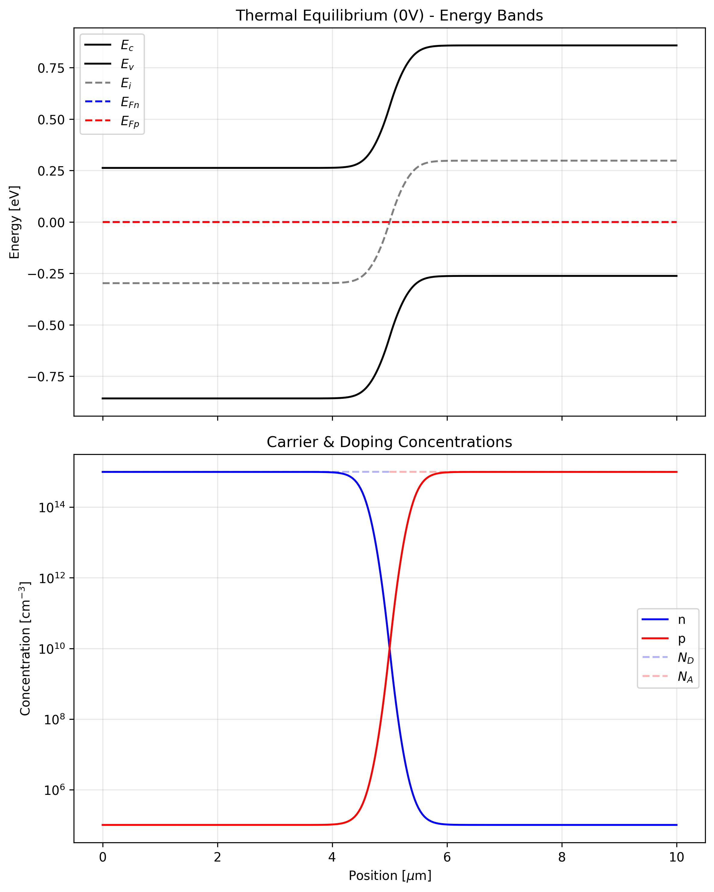
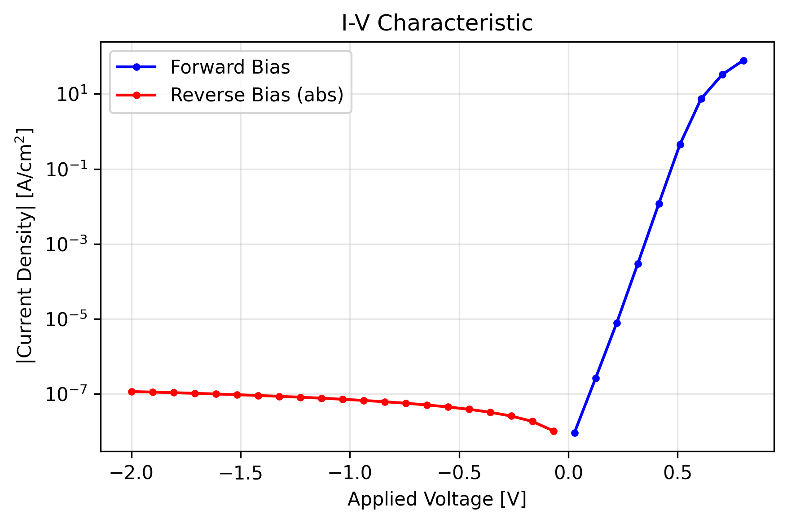

# Drift-Diffusion Semiconductor Simulator

A 1D drift-diffusion simulator for semiconductor P-N junction devices, built on [JAX](https://github.com/google/jax) for JIT compilation and automatic differentiation.

Solves the coupled Poisson and carrier continuity equations to compute electrostatics, carrier transport, and current flow in semiconductor junctions.




## Features

- **Steady-state and transient** simulation of 1D semiconductor devices
- **Scharfetter-Gummel** discretization for numerically stable current computation
- **Automatic Jacobians** via JAX forward-mode AD — no manual derivation required
- **JIT-compiled Newton-Raphson** solver using `jax.lax.while_loop` for fast iteration
- **De Mari scaling** (non-dimensionalization) for numerical conditioning
- **Non-uniform meshing** with configurable refinement near the junction
- **SRH recombination** model
- **Backward Euler** implicit time stepping for transient analysis
- **Voltage ramping** with damped Newton updates for robust convergence
- Band diagram, carrier profile, and I-V curve visualization

## Requirements

- Python 3
- [JAX](https://github.com/google/jax) (with 64-bit float support)
- [chex](https://github.com/google-deepmind/chex)
- NumPy
- Matplotlib

Install dependencies:

```bash
pip install jax jaxlib chex numpy matplotlib
```

For GPU acceleration, install JAX with CUDA support instead:

```bash
pip install jax[cuda12] chex numpy matplotlib
```

## Usage

Run the default Silicon PN junction simulation:

```bash
python main.py
```

This will:

1. Set up a 10 um Silicon PN junction at 300 K with symmetric doping (10^21 m^-3)
2. Generate a 200-point non-uniform mesh clustered at the junction
3. Solve for thermal equilibrium and save `eq_state.png`
4. Sweep voltage from -2.0 V to +0.8 V and save `iv_curve.png`

Forward-bias steady-state and transient simulations are available in `main.py` (commented out by default).

## Configuration

All parameters are configured by editing `main.py` directly. Key settings:

| Parameter | Default | Description |
|---|---|---|
| `L_si` | 10e-6 m | Device length |
| `junction_si` | 5e-6 m | Junction position |
| `n_points` | 200 | Mesh nodes |
| `refinement_factor` | 3.0 | Mesh clustering near junction |
| `T` | 300 K | Temperature |
| `ni` | 1e16 m^-3 | Intrinsic carrier concentration |
| `eps_r` | 11.7 | Relative permittivity (Si) |
| `mu_n_si` / `mu_p_si` | 0.1 / 0.05 m^2/Vs | Electron/hole mobilities |
| `tau_n_si` / `tau_p_si` | 1e-6 s | SRH carrier lifetimes |
| `N_D_si` / `N_A_si` | 1e21 m^-3 | Donor/acceptor doping |
| `max_iters` | 100 | Newton solver max iterations |
| `tol` | 1e-8 | Convergence tolerance |

## Project Structure

```
constants.py    # Physical constants & De Mari scaling
mesh.py         # Non-uniform 1D mesh generation
physics.py      # SG fluxes, SRH recombination, residual assembly
solver.py       # JIT-compiled Newton-Raphson solver with AD Jacobians
simulator.py    # Steady-state & transient simulation orchestrators
plot.py         # Band diagrams, carrier profiles, I-V curves
main.py         # Entry point: Si PN junction simulation
```

## Architecture

The code follows a pure functional design with immutable dataclasses (`chex.dataclass`):

- **`DeMariScaling`** converts between SI and dimensionless units, scaling lengths by the Debye length and potentials by the thermal voltage
- **`Grid`** holds the mesh nodes, spacings, and dual-cell widths
- **`Material`** stores scaled mobilities, lifetimes, and doping profiles
- **`State`** contains the solution variables: electrostatic potential (psi), electron density (n), and hole density (p)

The Newton-Raphson solver computes exact Jacobians using `jax.jacfwd` and applies damping (potential updates capped at 2 V_T) with carrier clamping to prevent divergence. Boundary conditions enforce ohmic contacts.

See [`simulator_plan.md`](simulator_plan.md) for the detailed design document.
